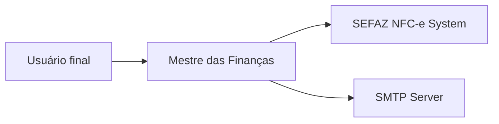

# Mestre das Finanças

> Personal-finance backend that goes one level deeper than typical expense trackers:
> it parses Brazilian NFC-e fiscal receipts at the **item** level, so you don't just
> see *"Supermarket R$ 320"* — you see every product, quantity, unit price, brand,
> and discount.

Built in **C# / .NET 7** with a layered Clean-Architecture / DDD-light style and a
PostgreSQL backing store.

---

## What the application does

Most personal-finance tools stop at the bank transaction. **Mestre das Finanças**
keeps going:

- Reads the **NFC-e** (Nota Fiscal de Consumidor Eletrônica) consultation page of
  Brazilian state tax authorities, scrapes the HTML, and extracts every line item
  of a supermarket receipt — sequence, description, quantity, unit, unit price,
  total, and discounts.
- Persists those items into a normalized model: a **Compra** (purchase) is the
  aggregate root, owning many **ItemCompra** records, each optionally tied to a
  **DescontoItem** (discount) and a global **Item** + **MarcaItem** (product +
  brand) catalog.
- Auto-creates the **Empresa** (vendor) record from the receipt's CNPJ and the
  **Item** catalog entries for any products not seen before, so the catalog grows
  on its own as you import receipts.
- Tracks the broader monthly picture alongside the receipts:
  - **Despesa** — expenses categorized as `Moradia`, `Transporte`,
    `Entretenimento`, `Investimentos`, `Animais`, `Pessoais`, `Mercado`,
    `Outros`, with optional date ranges and monthly-recurring flag.
  - **Renda** — income (with a `Salario` flag and link to vendor/consumer).
  - **Meta** + **MetaItem** — savings goals, with auto-calculated *monthly
    amount to save* based on target date and reserve already accumulated.
- Provides a user-management layer (**Usuario** + **Consumidor**) with email
  uniqueness validation and SMTP-based password recovery via a DB-stored
  **EmailProvider** credential.

The longer-term vision is a unified personal-finance data backend for an
AI-powered assistant — but today the codebase is focused on the ingestion +
domain model, not the analytics or AI layer.

---

## Tech stack

| Layer | Choice |
|---|---|
| Runtime | **.NET 7** / ASP.NET Core Web API |
| ORM | **Entity Framework Core 7** |
| Database | **PostgreSQL** (`Npgsql.EntityFrameworkCore.PostgreSQL`) |
| API docs | Swagger |
| HTML scraping | HtmlAgilityPack |
| Email | System.Net.Mail / MailKit (partial) |
| Auth | JWT (scaffolded, not active) |
| OData | Referenced, not wired |

---

## Architecture (Clean Architecture / DDD-light)

The solution is split into five projects:

MF.Api → MF.Application → MF.Domain
↘
MF.Repository + MF.Infrastructure

# 🌍 Context Diagram (C4 - Level 1)


---

# 🏗️ Container Diagram (C4 - Level 2)

```
flowchart TB

    User[Usuário]

    subgraph System[Mestre das Finanças]

        Api[MF.Api\nASP.NET Core Web API]
        App[MF.Application\nUse Cases]
        Domain[MF.Domain\nEntities & Rules]
        Repo[MF.Repository\nEF Core + PostgreSQL]
        Infra[MF.Infrastructure\nJWT + Email + Integrations]
    end

    DB[(PostgreSQL)]

    User --> Api
    Api --> App
    App --> Domain
    App --> Repo
    Repo --> DB

    App --> Infra
```
---

🔄 Sequence Diagram — NFC-e Import (Core Feature)

```
sequenceDiagram
    participant U as Usuário
    participant C as CompraController
    participant A as AplicCompra
    participant S as SEFAZ NFC-e
    participant P as HTML Parser
    participant R as Repository
    participant DB as PostgreSQL

    U->>C: Importar NFC-e URL
    C->>A: Execute import

    A->>S: Fetch NFC-e HTML
    S-->>A: HTML response

    A->>P: Parse receipt
    P-->>A: Compra + Itens DTO

    A->>R: Begin Transaction
    A->>R: Upsert Empresa
    A->>R: Create Items (if needed)
    A->>R: Create Compra + ItemCompra

    R->>DB: Commit
    DB-->>R: OK

    R-->>A: Success
    A-->>C: Result
    C-->>U: 200 OK
```

---

```
📊 Domain Model (DDD Overview)
flowchart LR

    Compra[Compra\nAggregate Root]
    ItemCompra[ItemCompra]
    Desconto[DescontoItem]

    Item[Item Catalog]
    Marca[MarcaItem]
    Empresa[Empresa]

    Despesa[Despesa]
    Renda[Renda]

    Meta[Meta]
    MetaItem[MetaItem]

    Usuario[Usuario]

    Compra --> ItemCompra
    ItemCompra --> Desconto
    ItemCompra --> Item

    Item --> Marca
    Compra --> Empresa

    Usuario --> Compra
    Usuario --> Despesa
    Usuario --> Renda
    Usuario --> Meta
    Meta --> MetaItem
```

---

## What's working today

- [x] NFC-e import with full item-level parsing
- [x] Auto creation of Empresa and Item catalog
- [x] Transactional persistence
- [x] CRUD for core entities
- [x] Expense and income tracking
- [x] Savings goals with projections

---

## Roadmap
**Short term**
- [ ] JWT authentication fully enabled
- [ ] Password hashing (replace plain text storage)
- [ ] Complete missing controllers (Despesa, Renda, Meta)
- [ ] Remove hardcoded NFC-e URL and paths

**Medium term**
- [ ] Spending analytics (category, vendor, item trends)
- [ ] Cash-flow dashboard
- [ ] Price history per item across vendors

**Long term**
- [ ] Bank statement ingestion
- [ ] AI-powered categorization
- [ ] Natural language finance assistant

---

## Running locally

```
cd MF
dotnet restore
dotnet ef database update --project MF.Repository --startup-project MF.Api
dotnet run --project MF.Api
```

## Swagger:

https://localhost:<port>/swagger

---

## Architecture note

This system is designed around:

Clean Architecture (Api → Application → Domain → Infra)
DDD aggregates for financial modeling
Transactional ingestion pipeline for NFC-e receipts
Extensible structure for future AI-driven financial analysis

It acts as a foundation for a unified personal-finance + assistant platform.
